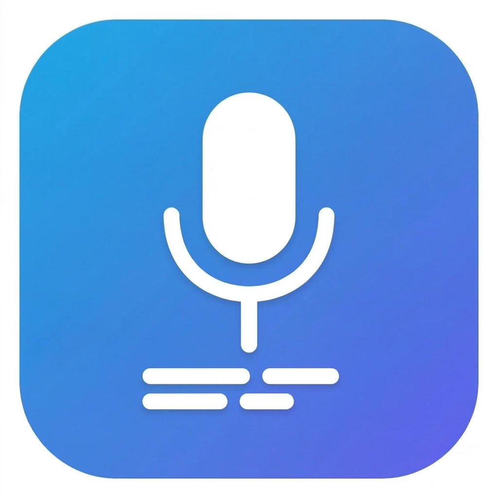

# ZhiYin 知音

> macOS 上最快的中文语音输入工具。按住说话，松开输入。

<p align="center">
  
</p>

<p align="center">
  <a href="README.md">English</a> ·
  <a href="https://github.com/Jason-Kou/zhiyin/releases">下载</a> ·
  <a href="https://x.com/AgentLabX">@AgentLabX</a>
</p>

---

知音是一款 macOS 菜单栏语音输入工具，专为**中文**和**中英混合**语音优化。按住快捷键说话，松开即可在任意应用中输入文字。所有处理完全在本地 Apple Silicon 上运行。

## 功能特点

- **按住说话** — 按住 `Option+空格`，说话，松开即转文字
- **实时预览** — 边说话边显示文字，松开后整段重新转写保证最准确度
- **中文优先** — 基于 FunASR MLX，针对普通话优化
- **多语言** — 中文、英文、日语、韩语、粤语
- **极速** — Apple Silicon 上约 0.5 秒完成识别
- **完全离线** — 所有处理在本机完成，数据不外传
- **全局可用** — 在任何接受文字输入的应用中使用
- **智能替换** — 语音命令自动转换，如"换行"→ 换行符、"句号"→ 。
- **上下文感知** — 自动获取选中文字和浏览器 URL
- **个人词典** — 自定义专业术语纠正
- **Power Mode** — 按应用自动切换配置
- **AI 润色** — 通过本地 Ollama LLM 可选文本优化
- **免费永久** — 每天 50 次免费，$12 Pro 解锁无限次

## 安装

### 下载安装

从 [Releases](https://github.com/Jason-Kou/zhiyin/releases) 下载最新 `.dmg`。

### 从源码构建

```bash
git clone https://github.com/Jason-Kou/zhiyin.git
cd zhiyin
./scripts/install.sh    # 自动配置 Python 环境和依赖
./scripts/run-dev.sh    # 编译并启动
```

**系统要求**：macOS 14.0+、Apple Silicon (M1/M2/M3/M4)、Python 3.10+

## 使用方法

1. 启动知音 — 菜单栏出现麦克风图标
2. 授予**麦克风**和**辅助功能**权限
3. 等待状态显示 "Ready"（首次启动模型加载约 10-30 秒）
4. 按住 **Option+空格** 开始说话
5. 松开 — 识别文字自动粘贴到光标位置

### 快捷键

| 快捷键 | 功能 |
|--------|------|
| Option+空格（按住） | 开始录音 |
| Option+空格（松开） | 停止录音并识别 |
| Cmd+, | 打开设置 |
| Cmd+Q | 退出 |

## 免费版 vs Pro

免费版每天 **50 次转写**，包含完整语音输入功能。

**Pro 版**（$12，一次性买断）解锁无限次转写。

## 对比

| | **知音** | **macOS 听写** | **Superwhisper** | **VoiceInk** | **微信语音输入** |
|---|---|---|---|---|---|
| 支持语言 | 14 种 | 有限 | 100+（Whisper） | 100+（Whisper） | 中文 + 少量 |
| 离线使用 | 是 | 部分（支持本地模型） | 是 | 是 | 否（需要联网） |
| 延迟 | ~0.5 秒 | ~1-2 秒 | ~1 秒 | ~1 秒 | 长语音容易卡顿 |
| 繁体中文输出 | 是（可切换） | 需单独语言包 | 否 | 否 | 是 |
| 个人词典 | 是 | 否 | 否 | 否 | 否 |
| 全局可用 | 是 | 是 | 是 | 是 | 是 |
| 价格 | 免费 / $12 Pro | 免费 | $10/月 | $25 | 免费 |

## 技术架构

| 组件 | 技术 |
|------|------|
| 语音识别 | [FunASR MLX](https://github.com/FunAudioLLM/SenseVoice)（阿里达摩院，默认）或 [Whisper Large v3 Turbo](https://github.com/openai/whisper)（OpenAI，99 种语言） |
| 运行时 | MLX on Apple Silicon（Neural Engine + GPU） |
| 前端 | Swift（SwiftUI + AppKit） |
| 后端 | Python（FastAPI + uvicorn） |
| 音频 | AVAudioEngine，16kHz 单声道 |

## 项目结构

```
zhiyin/
├── ZhiYin/Sources/     # Swift 应用
│   ├── App/            # 入口、AppDelegate
│   ├── Audio/          # 录音模块
│   ├── Input/          # 快捷键、文字注入
│   ├── License/        # 用量追踪、许可证
│   ├── STT/            # 语音识别客户端
│   └── UI/             # 设置界面、浮窗
├── python/             # Python STT 服务器
├── scripts/            # 构建、安装、打包脚本
└── assets/             # 应用图标
```

## 许可证

GPL-3.0 — 详见 [LICENSE](LICENSE)。

---

**知音** — *知道你的声音*
